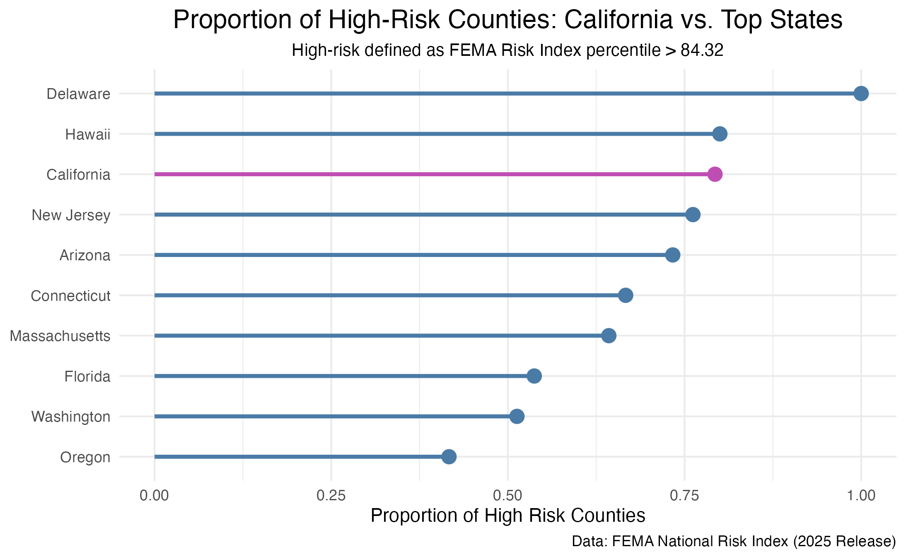

# Visualizing FEMA and ACS Data 
This repository is for analyzing FEMA National Risk Index data alongside the US Census Bureau’s American Community Survey (ACS). FEMA (Federal Emergency Management Agency) is a government agency tasked with helping Americans navigate disasters. The National Risk Index is a tool developed by FEMA to evaluate where communities are most at risk from natural hazards and why those communities are at risk. The ACS is a annualy nationwide survey and contains data on American's social, economic, housing, and demographic data. In this analysis, I determined how National Risk Index scores compare for counties in California versus counties in other states. 




## Contributor
**Isabella Segarra** Masters student at the Bren School of Environmental Science and Management MEDS program.

## Repository Structure 
This repository contains the following structure: 
```
.
├── data
│   ├── ACS-1yr-2023-county-race-ethnicity.csv
│   └── National_Risk_Index_Counties_807384124455672111.csv
├── eds240-nri-acs-viz.Rproj
├── figures
│   └── final_plot.png
├── final_plot.png
├── HW2.qmd
├── HW3.qmd
├── outputs
│   └── HW2_files
└── README.md

```
*Key Information*: 
The `HW2.qmd` and `HW3.qmd` contains the code for this analysis. All data has been added to the `gitignore`. 

## Data Access
The National Risk Index v1.20 data for this analysis can be accessed through the FEMA [Resilience Analysis and Planning Tool](https://experience.arcgis.com/experience/0a317e8998534c30a9b2d3861c814d42/) (RAPT). To download the data, navigate to the RAPT site, click on the 'NRI' button, find the National Risk Index Counties layer and download as a csv file. 

US Census Bureau (ACS) data was accessed through the the `{tidycensus}` package with the US Census Bureau API. The API can be accessed with the [request key](http://api.census.gov/data/key_signup.html) which will be sent to your associated email. Save this API in `.Renviron` file by running the following code in your console: `renusethis::edit_r_environ()`. 

## References
Federal Emergency Management Agency (FEMA), National Risk Index Dataset: National Risk Index County_National Risk Index_Rating_Composite - v1.20. Retrieved from FEMA GIS on January 25th, 2026, 10:30 am PST. This product uses the FEMA National Risk Index dataset API or downloadable datasets but is not endorsed by FEMA. The Federal Government or FEMA cannot vouch for the data or analyses derived from these data after the data have been retrieved from the Agency's website(s).

## Acknowledgments 
I would like to acknowledge the EDS-240 Data Visualization and Communications course instructor and co-instructor Sam Shanny-Csik and Annie Adams. 


